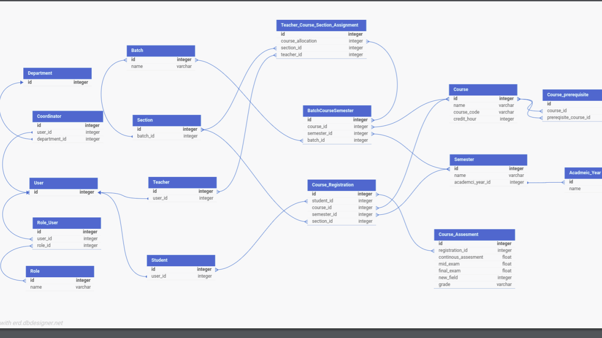

# Student Information Management System (SIMS)

A Laravel-based Student Information Management System (SIMS) designed to manage various aspects of student data and user roles for the **American College of Technology (ACT)**.



## Features

-   Role-based access control:
    -   Admins, Registrars, Teachers, Coordinators, and Students.
-   User authentication with username-based login.
-   Batch and section management.
-   Course allocation and prerequisite management.
-   Semester-wise student and course management.
-   Assessment and grading system for teachers.
-   Profile image management using Laravel Media Library.
-   Dynamic filtering and pagination for large datasets.
-   Integration of Vue.js for interactive front-end components.
-   Tailwind CSS for responsive UI design.

---

## Prerequisites

Before running this application, ensure you have the following installed:

-   PHP 8.1 or higher
-   Composer
-   Laravel 11
-   Node.js and npm
-   MySQL 5.7 or higher / MariaDB 10.2 or higher

---

## Installation

Follow these steps to set up the project on your local machine:

1. Clone the repository:
    ```bash
    git clone https://github.com/your-username/sims.git
    cd sims
    # Student Information Management System (SIMS)
    ```

A Laravel-based Student Information Management System (SIMS) designed to manage various aspects of student data and user roles for the **American College of Technology (ACT)**.

## Features

-   Role-based access control:
    -   Admins, Registrars, Teachers, Coordinators, and Students.
-   User authentication with username-based login.
-   Batch and section management.
-   Course allocation and prerequisite management.
-   Semester-wise student and course management.
-   Assessment and grading system for teachers.
-   Profile image management using Laravel Media Library.
-   Dynamic filtering and pagination for large datasets.
-   Integration of Vue.js for interactive front-end components.
-   Tailwind CSS for responsive UI design.

---

## Prerequisites

Before running this application, ensure you have the following installed:

-   PHP 8.1 or higher
-   Composer
-   Laravel 11
-   Node.js and npm
-   MySQL 5.7 or higher / MariaDB 10.2 or higher

---

## Installation

Follow these steps to set up the project on your local machine:

1. Clone the repository:

    ```bash
    git clone https://github.com/your-username/sims.git
    cd sims
    composer install
    npm install
    cp .env_example .env
    php artisan key:generate


    ```
